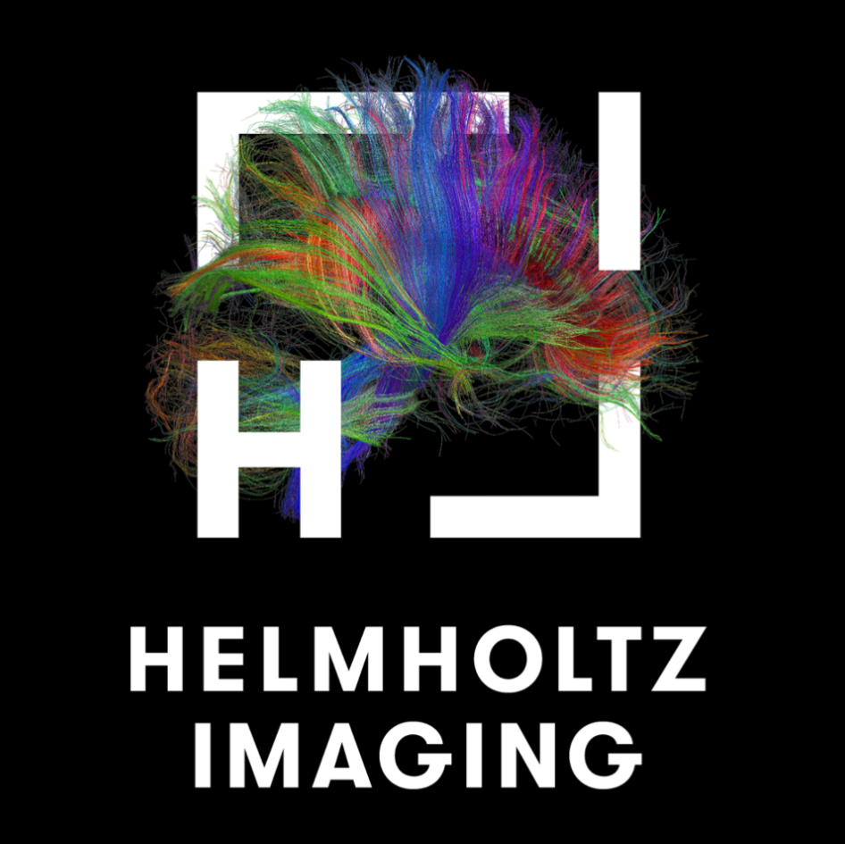

# Dynamic Network Architectures

This repository contains several ResNet, U-Net and VGG architectures in pytorch that can be dynamically adapted to a varying number of image dimensions (1D, 2D or 3D) and the number of input channels.

## Available models
### ResNet
We implement the standard [ResNetD](https://arxiv.org/pdf/1812.01187.pdf) 18, 34, 50 and 152. For ResNets 50 and 152 also bottleneck implementations are available. Moreover, adapted versions that are better suited for smaller image sizes such as CIFAR can be used.

All models additionally include regularization techniques like [Stochastic Depth](https://arxiv.org/pdf/1603.09382.pdf), [Squeeze & Excitation](https://arxiv.org/pdf/1709.01507.pdf) and [Final Layer Dropout](https://jmlr.org/papers/volume15/srivastava14a/srivastava14a.pdf). 

### VGG
In contrast to the original [VGG](https://arxiv.org/pdf/1409.1556.pdf) implementation we exclude the final fully-connected layers in the end and replace it by additional convolutional layers and only one fully-connected layer in the end. Adapted versions that are better suited for smaller image sizes such as CIFAR can be used.

### U-Net
For the [U-Net](https://arxiv.org/pdf/1505.04597.pdf) a plain convolutional encoder as well as a residual encoder are available. 

# Acknowledgements

   &nbsp;&nbsp;&nbsp;&nbsp;
   

This Repository is developed and maintained by the Applied Computer Vision Lab (ACVL)
of [Helmholtz Imaging](https://www.helmholtz-imaging.de/).